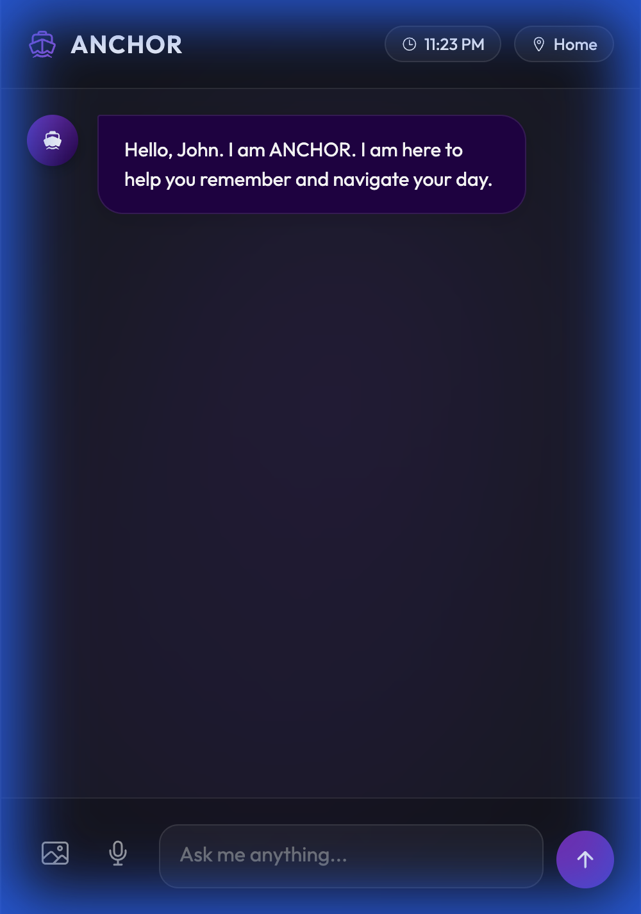
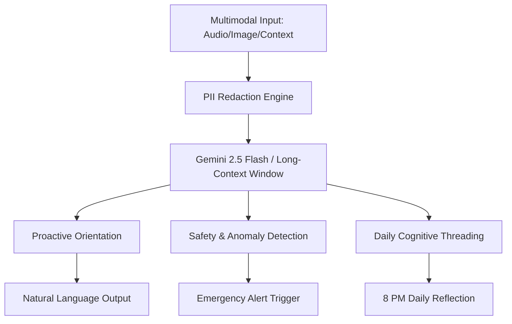

# ANCHOR: The Cognitive Prosthetic Intelligence

<p align="center">
  
</p>

<p align="center">
  
  
  
  
</p>

---

## 🧠 Overview
**ANCHOR** is an advanced, AI-driven Cognitive Prosthetic designed to restore dignity and functional independence to individuals with Alzheimer’s, dementia, or severe memory impairment. By serving as an external **"Working Memory,"** ANCHOR bridges the gap between disorientation and clarity.

## 📱 Interface Snapshot
<p align="center">
  
</p>

## 🛠️ Technical Architecture

### The "Cognitive Threading" Pipeline
ANCHOR utilizes a **2-million token context window** to maintain a persistent state of the user's day, ensuring that every interaction is contextually aware and empathetic.



## 🚀 Key Features

### 1. **Proactive Orientation**
Automatically identifies individuals, objects, and locations. 
- *Input*: Image of a neighbor.
- *Response*: "That is Sarah, your neighbor. She is wearing a green coat today."

### 2. **Anomaly Detection & Redirection**
Monitors for 'Sundowning' patterns or GPS wandering.
- *Logic*: If time is evening and GPS indicates an unfamiliar route, ANCHOR initiates calming redirection.

### 3. **PII Safety Layer**
Robust regex-based redaction ensures that sensitive numerical data (bank PINs, credit cards) never leave the local environment or enter the model's history without masking.

## 💻 Tech Spec
- **Core Engine**: Google Gemini Pro 1.5/2.5
- **Web Backend**: FastAPI (Python)
- **Frontend**: ES6+ JavaScript, CSS3 (Glassmorphism), Semantic HTML5
- **Security**: Local `.env` management and pattern-matching redaction.

## ⚙️ Setup & Deployment

```bash
# Clone the repository
git clone https://github.com/LiwaaCoder/ANCHOR-Agent.git

# Install expert-tier dependencies
pip install -r requirements.txt

# Configure your secure credentials
cp .env.example .env

# Launch the platform
uvicorn server:app --reload
```

---
<p align="center">
  <i>"Empowering memory through intelligent companionship."</i>
</p>
